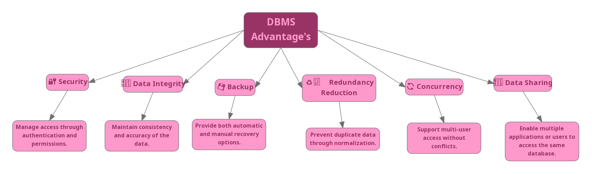

# 📘 Database Course Documentation

This repository contains a comprehensive report covering key concepts in database systems .

---

## 1️⃣ Flat File Systems vs. Relational Databases

| Feature         | Flat File Systems                 | Relational Databases                   |
|----------------|-----------------------------------|----------------------------------------|
| Structure       | Single table or document (e.g., CSV) | Organized into multiple related tables |
| Data Redundancy | High – same data repeated         | Low – normalization reduces repetition |
| Relationships   | Not supported                     | Supported via primary/foreign keys     |
| Example Usage   | Excel sheets, simple data storage | Web apps, ERPs, banking systems        |
| Drawbacks       | Poor scalability, redundancy      | Requires schema design, setup overhead |

📌 **Summary**: Flat file systems are suitable for simple use cases, while relational databases provide structure, scalability, and consistency for complex data operations.

---

## 2️⃣ DBMS Advantages – Mind Map

🧠 Below is a mind map showing the key advantages of a DBMS.

*Image created using [Canva](https://www.canva.com/)*

---

## 3️⃣ Roles in a Database System

Understanding who does what in a database project is crucial. Below are key roles and their responsibilities:

| Role                     | Description |
|--------------------------|-------------|
| **System Analyst**       | Gathers user requirements and analyzes how the system should behave. Acts as a bridge between users and developers. |
| **Database Designer**    | Designs the database schema including tables, fields, relationships, and constraints based on system requirements. |
| **Database Developer**   | Implements the design using SQL and DBMS tools. Writes queries, procedures, and ensures data is stored efficiently. |
| **Database Administrator (DBA)** | Manages the database's day-to-day operations: security, backups, performance tuning, user roles, and disaster recovery. |
| **Application Developer**| Integrates the database with software applications (web/mobile). Uses SQL or ORM tools to fetch and update data. |
| **BI Developer**         | Uses the data in the database to build reports, dashboards, and analytical models for business decision-making. |

📌 **Note:** In small teams, some of these roles may be combined, while in larger enterprises, they are often specialized.

---

## 4️⃣ Types of Databases

Understanding different types of databases helps in choosing the right one based on the application’s needs.

---

### 🔄 Relational vs. Non-Relational

| Type             | Description                                                                 | Examples              |
|------------------|-----------------------------------------------------------------------------|-----------------------|
| **Relational**   | Uses structured tables with rows and columns. Supports SQL queries and relationships through keys. | MySQL, PostgreSQL, Oracle |
| **Non-Relational** | Uses flexible formats like documents, key-value pairs, graphs, or columns. Suitable for big data and fast-changing data. | MongoDB, Cassandra, Firebase |

---

### 🗺️ Centralized vs. Distributed vs. Cloud Databases

| Type             | Description                                                                 | Example Use Case                |
|------------------|-----------------------------------------------------------------------------|----------------------------------|
| **Centralized**   | All data is stored and managed in a single location or server.             | Small business inventory system |
| **Distributed**   | Data is spread across multiple servers or locations but appears as one system. | Global banking or e-commerce   |
| **Cloud**         | Data is hosted by third-party providers with on-demand scalability.         | Web and mobile apps (e.g., Amazon RDS) |

📌 **Tip:** Distributed and cloud databases are often combined in modern applications to ensure high availability and performance.

---

## 5️⃣ Cloud Storage and Databases

### What is Cloud Storage?
Cloud storage allows storing data remotely on internet-connected servers, supporting scalability and backups for databases.

### Advantages of Cloud-Based Databases:
- Elastic scaling
- No local infrastructure needed
- High availability
- Examples: Amazon RDS, Azure SQL, Google Spanner

### Disadvantages:
- Requires internet connection
- Subscription costs
- Security/privacy concerns

---

## 📋 Conclusion

This report summarizes the essential concepts of database systems including structure comparison, system roles, database types, and the future of cloud-based databases.

---

## 📁 Files Included

- `README.md` – main report
- `/images/` – contains DBMS mind map and other visuals
